# Docker + Python service

Created a service using Docker and Python, that satisfies the following requirements:

1. Through remote service API calls,
a. The users can post integers to the service.
b. The users can get the number of times a specific value was posted.
c. Users can post/get values/amounts of other types (e.g., float, string) / any type.

2. The service stores the values:
a. In memory

3. Through remote service API calls,
a. Users can request the average of all stored integers.
b. Users can request the average of values with a specific type (e.g. float/int).


## Command to run this repo locally


 ```bash
 git clone https://github.com/harshvardhan0709/python_continental.git
 cd python_continental
 docker-compose build
 docker-compose up
 ```

## API Calls Using Postman

##### 1. Retrieve all sensor data 

API Call - http://localhost:5000/sensor  <br/>
method - GET <br/>


##### 2. Post Sensor data(Integer value, Float value, string value)

##### Integer Value
API Call - http://localhost:5000/sensor <br/>
method - POST <br/>
body = { <br/>
    "sensor_data" : 15, <br/>
} 

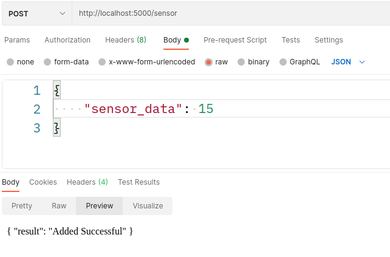


##### Float Value

API Call - http://localhost:5000/sensor <br/>
method - POST <br/>
body = { <br/>
    "sensor_data" : 15.124, <br/>
} 

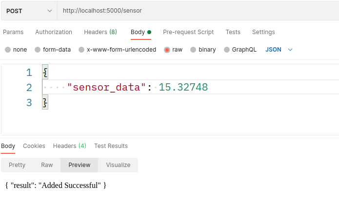


##### String Value

API Call - http://localhost:5000/sensor <br/>
method - POST <br/>
body = { <br/>
    "sensor_data" : "15", <br/>
} 

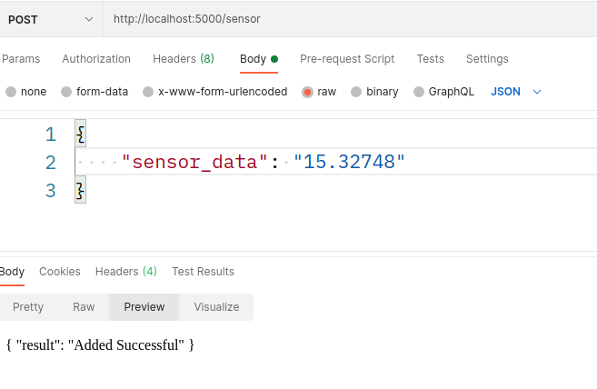


##### 3. Retrieve all sensor data of specific type(Integer, Float, String value)

##### Integer Value data only
API Call - http://localhost:5000/sensor/int <br/>
method - GET <br/>

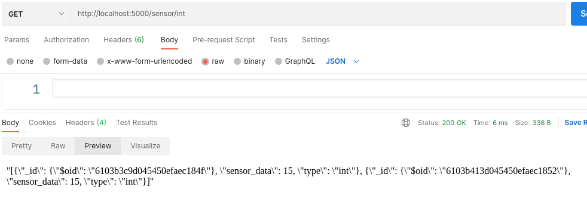


##### Float Value data only
API Call - http://localhost:5000/sensor/float <br/>
method - GET <br/>

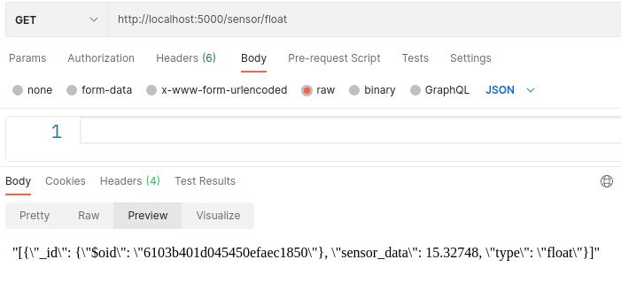


##### String Value data only
API Call - http://localhost:5000/sensor/str <br/>
method - GET <br/>

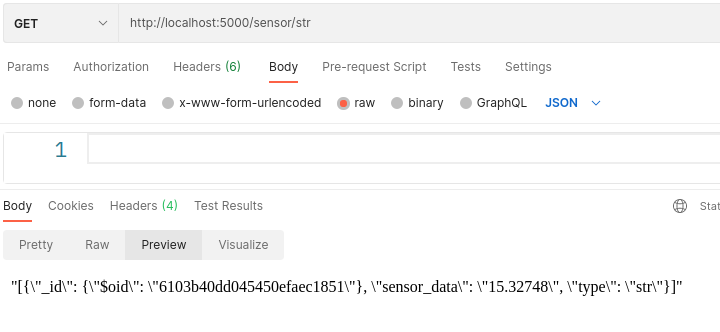


##### 4. Get number of times a specific value was posted(Integer, float, string value).

##### Integer Value count only
API Call - http://localhost:5000/sensor_count/<specific_value>/int <br/>
method - GET <br/>

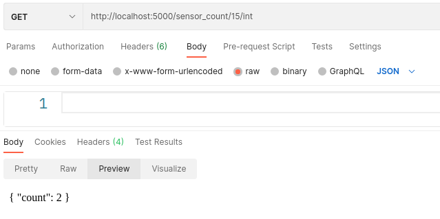


##### Float Value data only
API Call - http://localhost:5000/sensor_count/<specific_value>/float <br/>
method - GET <br/>

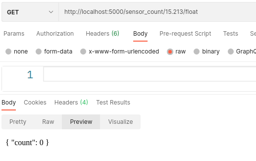


##### String Value data only
API Call - http://localhost:5000/sensor_count/<specific_value>/str <br/>
method - GET <br/>

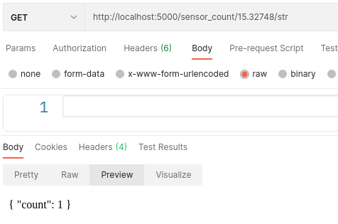


##### 5. Get average of all stored(Integer/ Float)

##### Integer Value average only
API Call - http://localhost:5000/sensor_avg/int <br/>
method - GET <br/>

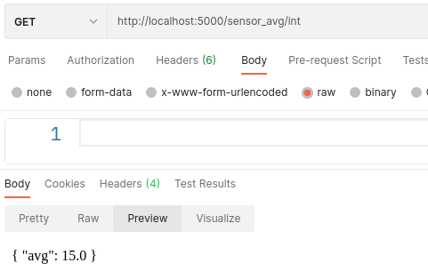


##### Float Value average only
API Call - http://localhost:5000/sensor_count/float <br/>
method - GET <br/>

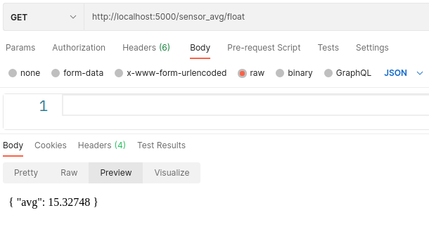
